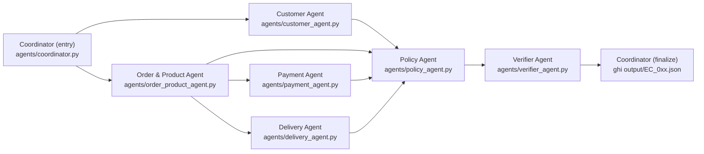

# Architecture — K4 Day 09 Multi-Agent E-commerce Dispute Resolution

## Tổng quan

Hệ thống dùng **LangGraph** (Python) làm orchestration engine cho một DAG 7 node xử lý mỗi case khiếu nại. LLM được gọi qua chuỗi fallback **5 tầng, xếp theo độ mạnh giảm dần**, toàn bộ đã **test gọi API thật** (không chỉ đọc trang catalog) tại thời điểm build (08/2026):

1. OpenRouter → `qwen/qwen-2.5-7b-instruct` (7B) — mạnh nhất đã xác minh hoạt động
2. OpenRouter → `meta-llama/llama-3.1-8b-instruct` (8B)
3. OpenRouter → `meta-llama/llama-3.2-3b-instruct` (3B)
4. NVIDIA NIM → `meta/llama-3.1-8b-instruct` (8B)
5. Groq → `llama-3.1-8b-instant` (8B)

Tất cả ≤10B theo README mục 9. Nhiều model "trông mạnh hơn" trên giấy đã bị loại vì **test thật thất bại**: `qwen/qwen3.5-9b` trên OpenRouter treo vô thời hạn (2 lần test độc lập), `google/gemma-2-9b-it` và `mistralai/mistral-7b-instruct-v0.3` trả 404 trên OpenRouter dù trang model vẫn hiển thị tồn tại, `gemma2-9b-it` đã bị Groq decommission dù docs (đọc qua WebFetch) báo vẫn active — bài học: chỉ tin kết quả gọi API thật, không tin trang tài liệu/catalog. Mỗi tầng thử tối đa 3 lần (timeout 15s/request) trước khi rớt xuống tầng kế tiếp (`llm/llm_client.py`).

Nguyên tắc cốt lõi: **mọi số liệu/ID/quyết định bị chấm điểm nghiêm ngặt** — reconciliation (đối soát payment), delivery variance, seller handoff variance, primary/secondary issue, responsible party, refund, evidence ID — đều được tính bằng **code Python thuần** trong `core/*.py`, **không giao cho LLM**. LLM chỉ được dùng ở một số agent để viết note diễn giải/tóm tắt bằng ngôn ngữ tự nhiên phục vụ trace, và **không bao giờ được phép ghi đè lên số liệu đã tính** bởi core logic.

Lý do lựa chọn này: README mục 5 cảnh báo rõ evidence sai hoặc bịa bị tính là false positive, và README mục 8 quy định case bị hard-gate nhận 0 điểm. Nếu để LLM tự do sinh số liệu hoặc evidence ID, rủi ro hallucination trên các trường bị chấm điểm là không chấp nhận được. Do đó kiến trúc tách bạch: **domain logic xác định (arithmetic, lookup CSV, áp policy) = code Python; narration/giải thích tự nhiên = LLM**.

## Sơ đồ luồng

DAG xử lý 1 case, đúng theo gợi ý mục 7 của README (7 node):



Giải thích các nhánh song song / tuần tự:

- **Customer Agent** chạy song song với **Order & Product Agent** ngay sau Coordinator (entry) vì hai domain dữ liệu độc lập nhau (customer/order-history so với item/seller/product).
- **Payment Agent** và **Delivery Agent** chạy sau **Order & Product Agent** vì cả hai cần danh sách item và seller mà Order & Product Agent đã trích xuất (đối soát payment cần item + freight; tính handoff variance cần seller + shipping_limit_date).
- **Policy Agent** tổng hợp toàn bộ 4 nhánh trên (Customer, Order & Product, Payment, Delivery) để áp `EC_POLICY_V2`.
- **Verifier Agent** kiểm tra kết quả trước khi **Coordinator (finalize)** ghi file `output/EC_0xx.json`.

## Vai trò & quyền truy cập

Nguyên tắc least privilege: **mỗi agent chỉ đọc đúng phần dữ liệu cần cho domain của nó** qua `core/data_loader.py:DataStore`, không agent nào được đọc toàn bộ 9 CSV.

| Agent | File | Vai trò | Data access (qua `core/data_loader.py` `DataStore`) | Dùng LLM? |
|---|---|---|---|---|
| Coordinator | `agents/coordinator.py` | Nhận case input, build & chạy LangGraph, tổng hợp + ghi `output/EC_0xx.json` | Không truy cập CSV trực tiếp, chỉ điều phối state | Không (thuần orchestration) |
| Customer Agent | `agents/customer_agent.py` | Xác định `customer_unique_id` + lịch sử order liên quan | `customers.csv`, `orders.csv` (qua `get_customer`, `get_related_order_ids`) — core logic ở `core/customer.py` | Có — 1 LLM call diễn giải `customer_context` |
| Order & Product Agent | `agents/order_product_agent.py` | Trích item, seller, product, category của order | `order_items.csv`, `products.csv`, `sellers.csv` — core logic ở `core/order_product.py`. `category_names` giữ nguyên giá trị gốc tiếng Bồ Đào Nha từ cột `product_category_name` (khớp tên field output với tên cột CSV), không dịch qua `product_category_name_translation.csv` | Có — 1 LLM call tóm tắt entity |
| Payment Agent | `agents/payment_agent.py` | Đối soát payment vs item + freight | `order_payments.csv` + items từ Order & Product Agent — core logic ở `core/payment.py` | Không (thuần arithmetic, độ chính xác quan trọng hơn narration) |
| Delivery Agent | `agents/delivery_agent.py` | Tính delivery variance + seller handoff variance | `orders.csv` (dates) + items từ Order & Product Agent — core logic ở `core/delivery.py` | Không (thuần arithmetic) |
| Policy Agent | `agents/policy_agent.py` | Áp `EC_POLICY_V2`: primary/secondary issue, responsible party, refund, action | Không đọc CSV, chỉ nhận state tổng hợp từ 4 agent trên — core logic ở `core/policy_rules.py` | Có — 1 LLM call viết root-cause justification cho trace + đề xuất confidence tham khảo (số confidence cuối cùng vẫn tính bằng `core/policy_rules.py:compute_confidence`, LLM không override) |
| Verifier Agent | `agents/verifier_agent.py` | Kiểm tra schema, evidence ID, giới hạn mảng, null-handling trước khi ghi file | `core/schemas.py` (pydantic) + `core/data_loader.py` (re-check evidence tồn tại thật) — read-only | Không (validation phải deterministic) |

## Handoff & state

State truyền giữa các node là một `TypedDict` **`AgentState`** (định nghĩa ở `agents/state.py`) chứa case input gốc, sau đó lần lượt được các node bổ sung field kết quả domain của mình:

```text
AgentState
├── case input gốc (từ input/EC_0xx.json)
├── customer_result        (do Customer Agent ghi)
├── order_product_result   (do Order & Product Agent ghi)
├── payment_result         (do Payment Agent ghi)
├── delivery_result        (do Delivery Agent ghi)
├── policy_result          (do Policy Agent ghi)
└── verifier_result         (do Verifier Agent ghi)
```

Mỗi node **chỉ đọc field của các node đã chạy trước nó theo DAG**, không đọc trước field chưa tồn tại (ví dụ: Payment Agent đọc `order_product_result` nhưng không đọc `policy_result` vì Policy Agent chưa chạy tại thời điểm đó).

## Verification gate

Verifier Agent parse toàn bộ state cuối cùng thành `core.schemas.CaseOutput`. Nếu:

- `ValidationError` (sai schema, thiếu field, sai kiểu, vượt giới hạn mảng), hoặc
- evidence tham chiếu ID (order/item/payment/seller) **không tồn tại trong CSV thật**

thì Verifier Agent **ghi log lỗi vào trace kèm case_id**, **không tự sửa số liệu**. Triết lý ở đây là best-effort raise để lộ bug thay vì âm thầm ghi output sai — một case sai được phát hiện và log rõ ràng còn hơn một case sai bị nộp mà không ai biết.

## Model & runtime

- **Trace**: mỗi lần một agent (node) chạy xong sẽ ghi 1 dòng vào `logging/trace.jsonl` gồm `case_id`, agent name, input tóm tắt, output tóm tắt, model dùng (nếu có gọi LLM). File này bị **ghi đè mỗi lần chạy pipeline mới** (không append tích lũy).
- **Metadata**: `logging/metadata.json` khai báo `model.provider_fallback_chain` (5 tầng theo rank ở mục Tổng quan, mỗi tầng tối đa 3 lần thử + timeout 15s trước khi fallback), `framework` (LangGraph + langchain-openai), `runtime` (Python 3.13 qua `uv` venv).
