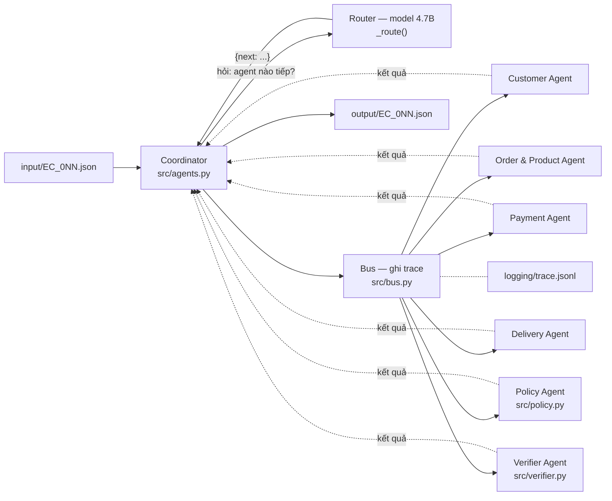

# Kiến trúc multi-agent — Day 9 E-commerce Dispute Resolution

Hệ gồm 7 agent. Mỗi agent chỉ nhận lát dữ liệu của mình, mọi lần chuyển việc đi qua một bus duy nhất, và bus ghi lại một dòng trace cho mỗi lần chuyển.

Điều phối do model quyết định. Coordinator không giữ sẵn thứ tự nào: ở mỗi bước nó gửi cho model danh sách agent đã chạy và chưa chạy, model trả về agent chạy tiếp, coordinator cắt lát dữ liệu tương ứng rồi gọi qua bus. Vòng lặp dừng khi cả 6 agent đã chạy — 6 lần gọi model cho mỗi case.

## Sơ đồ agent

## Điều phối bằng model

`_route()` trong `src/agents.py` gọi model một lần cho mỗi bước với đúng hai thông tin: agent nào đã chạy, agent nào chưa. Model trả `{"next": "<tên_agent>"}`.

Coordinator không xếp thứ tự, nhưng nó giữ bảng phụ thuộc `DEPENDS` và từ chối lựa chọn chưa đủ đầu vào: `policy_agent` cần kết quả của cả 4 agent dữ liệu, `verifier_agent` cần kết luận của `policy_agent`. Chọn tên lạ, chọn agent đã chạy, hoặc chọn agent thiếu phụ thuộc thì coordinator lấy phần tử đầu của tập hợp lệ và trace ghi `fallback_dependency_order` thay vì `llm_route`.

Chỗ chặn này là cần thiết chứ không phải hình thức: nếu model gọi `policy_agent` khi mới chạy 2 agent dữ liệu thì `src/policy.py` đọc phải `analysis` thiếu khoá và cả case chết. Lượt chạy hiện tại **300/300 quyết định đều là `llm_route`**, không lần nào phải chặn.

Vì 4 agent dữ liệu độc lập nhau và ràng buộc phụ thuộc bảo đảm policy/verifier luôn chạy sau, mọi thứ tự hợp lệ đều cho cùng một output. Đã kiểm chứng: chuyển từ thứ tự cố định sang điều phối bằng model cho ra 50 file **không đổi một byte**.

## Quyền truy cập dữ liệu

Coordinator cắt bundle thành 4 lát trong `_slices()` trước khi gửi. Ranh giới dưới đây là cơ chế thật, không phải quy ước: một agent không nhận được bảng nằm ngoài lát của nó nên không thể đọc bảng đó.

| Agent | Bảng đọc được | Trả về khoá nào trong output | Bên nhận | Gọi model |
|:---|:---|:---|:---|:---:|
| Coordinator | input JSON + bundle đầy đủ (bên duy nhất mở `datastore`) | gộp toàn bộ output cuối | ghi file | có |
| Customer Agent | `customers`, `orders_by_unique_customer` | `customer_context` | Coordinator | không |
| Order & Product Agent | `items`, `products`, `sellers`, bảng dịch category | `affected_entities` (order/item/seller), `product_context` | Coordinator | không |
| Payment Agent | `payments`, `items` | `payment_reconciliation`, `affected_entities.payment_ids` | Coordinator | không |
| Delivery Agent | `orders`, `items`, `sellers` | `delivery_analysis` | Coordinator | không |
| Policy Agent | kết quả 4 agent trên + 5 trường tối thiểu của order (`_policy_slice`) | `case_assessment`, `root_cause_analysis`, `financial_resolution`, `resolution_actions`, `evidence_ids` | Coordinator | không |
| Verifier Agent | JSON đã dựng xong + `orders`/`items`/`payments`/`sellers` để đối chiếu ID có thật | danh sách lỗi | Coordinator | có |

Payment Agent và Delivery Agent cùng đọc `items` vì cả hai cần dữ liệu item, nhưng Payment Agent không thấy `orders` nên không thể tự suy ra kết luận giao hàng, và Delivery Agent không thấy `payments` nên không thể tự quyết số tiền hoàn.

Hai chỗ từng phá ranh giới này đã sửa: `build_product_context` trước đây tự gọi `load_all()` để lấy bảng dịch category — mở `load_all()` là mở cả 8 index, tức Order & Product Agent đọc được `orders` và `payments`. Nay bảng dịch đi kèm lát dữ liệu do Coordinator cắt sẵn. Tương tự, Policy Agent trước nhận nguyên bundle; nay `_policy_slice()` chỉ gửi `order_status`, `order_item_id`, `payment_sequential`, danh sách seller và `order_id` — đúng những gì `src/policy.py` đọc tới.

Verifier Agent có đọc `datastore` là cố ý: luật 8 phải đối chiếu từng evidence ID với CSV thật, nếu không thì không phát hiện được ID bịa.

## Ranh giới code và agent

Chỉ 2 trong 7 agent gọi model. Toàn bộ con số trong output do code xác định sinh ra.

| Việc | Ai làm | Vì sao |
|:---|:---|:---|
| Chênh lệch giờ giao, chênh lệch bàn giao | `src/tools.py` | Model 4.7B tính hiệu hai timestamp ra số sai; 15% rubric phụ thuộc con số này |
| Đối soát item + freight với payment | `src/tools.py` | Sai số 0.10 BRL là ngưỡng cứng, không phải phán đoán |
| Chọn primary issue, refund, actions | `src/policy.py` | Thứ tự ưu tiên là luật, không phải ý kiến |
| Dựng evidence ID | `src/policy.py` | Sai một ký tự là false positive |
| Chọn agent chạy tiếp ở mỗi bước | Coordinator + model | Điều phối thật: model quyết định đường đi, code chỉ chặn khi thiếu phụ thuộc |
| Nhận xét về kết luận của case | Verifier + model | Ghi vào trace, không được phép lật kết luận của bộ kiểm xác định |

Một trường hợp cụ thể đã chuyển từ model sang code: ban đầu Verifier Agent định để model phán "output này có hợp lệ không". Model 4.7B duyệt qua cả file sai định dạng evidence. Nên 12 luật kiểm ở `src/verifier.py` mới là quyết định cuối cùng, còn câu trả lời của model chỉ được ghi vào `logging/trace.jsonl` để đối chiếu. Bằng chứng: chèn tay `evidence_ids[1] = "item:1"` thì bộ kiểm báo `luat 7` và `luat 8`.

Chỗ chặn thật nằm ở `scripts/make_zip.py`: còn lỗi thì không đóng gói. `src/run_all.py` vẫn ghi file xuống `output/` kể cả khi verifier báo lỗi và trả exit code khác 0 — thiếu hẳn một file thì case đó chắc chắn 0 điểm, còn file sai một trường thì các trường còn lại vẫn ăn điểm.

Cả hai prompt gọi model đều đã sửa sau khi đọc trace. Bản đầu tiên hỏi model một lần duy nhất để lấy cả 4 tên agent cùng lúc; model 4.7B trả về 3 tên (bỏ `delivery`) nên 50/50 case rơi về fallback — model có được gọi nhưng không đóng góp gì. Chuyển sang hỏi từng bước một, mỗi lần chỉ chọn một tên trong danh sách chưa chạy, thì model trả đúng 300/300 lần. Prompt Verifier ban đầu không nói `deterministic_errors` rỗng nghĩa là gì, model trả `approved: false` cho cả 50 case sạch; thêm đúng quy tắc đó vào prompt thì thành `approved: true` 50/50, và vẫn trả `false` khi cố tình chèn một lỗi vào bản tóm tắt.

Cả hai chỗ gọi model đều có đường lui: `src/llm.py` trả `None` khi gọi hỏng, Coordinator rơi về thứ tự thoả phụ thuộc và Verifier vẫn chạy đủ 12 luật. Tắt hẳn model bằng `LLM_ENABLED=0` thì 50 output không đổi một byte.

## Luồng handoff

Mỗi mũi tên là một envelope `{from, to, task, payload}` đi qua `bus.send()`, và bus ghi một dòng vào `logging/trace.jsonl` kèm `payload_keys`, `result_keys`, `status`, `latency_ms`.

Mỗi bước điều phối sinh hai dòng: một dòng `route` ghi model chọn gì, rồi một dòng `send` ghi lần chuyển việc thật.

| # | Từ | Đến | Task | Bàn giao |
|---:|:---|:---|:---|:---|
| lẻ | coordinator | trace | `route` | `next` model chọn, `source` là `llm_route` hoặc `fallback_dependency_order`, và `done` tại thời điểm đó |
| chẵn | coordinator | `<agent>_agent` | tuỳ agent được chọn | kết quả của agent đó |
| 13 | verifier_agent | trace | `review` | lỗi xác định + nhận xét của model |

Sáu agent được điều phối, theo thứ tự model chọn ở lượt chạy hiện tại:

| Agent | Task | Bàn giao |
|:---|:---|:---|
| customer_agent | `analyze_customer` | `customer_context` |
| order_product_agent | `analyze_order_product` | order/item/seller ids, `product_context` |
| payment_agent | `analyze_payment` | `payment_reconciliation`, `payment_ids` |
| delivery_agent | `analyze_delivery` | `delivery_analysis` |
| policy_agent | `apply_ec_policy_v2` | phân loại, refund, actions, evidence |
| verifier_agent | `verify_schema` | danh sách lỗi |

Một case sinh ra đúng 13 dòng trace: 6 dòng `route`, 6 dòng chuyển việc, 1 dòng `review`. Chạy 50 case cho 650 dòng, và `run_all.py` ghi đè file trace ở đầu mỗi lượt nên trace luôn là của lượt mới nhất.

Handler ném exception thì bus ghi `status=error:<Tên lỗi>` rồi ném tiếp — nuốt lỗi ở tầng bus sẽ làm một case biến mất trong im lặng.

## Hiệu chỉnh bằng bộ chấm thật

Một quyết định trong `src/tools.py` không suy ra được từ đề bài mà phải đo: `delivery_analysis.seller_handoff_analysis` nên liệt kê mọi seller của order, hay chỉ seller giao muộn? README mục 6 chỉ đưa ví dụ một order một seller nên không phân định được.

Cách tìm ra là thu hẹp dần chứ không đoán. Đầu tiên đo biến thể `NULL_MONEY` riêng lẻ: 6 case không có item row rơi từ ~100 xuống 0, tức nhóm đó vốn đã hoàn hảo. Vì tổng là 79.1543, suy ra 44 case *có* item row chỉ đang được ~76.3 — toàn bộ điểm mất nằm ở một trường dẫn xuất từ item. Trong các ứng viên thì `seller_handoff_analysis` phủ rộng nhất, nên thử trước, và đúng: **79.1543 → 91.8029**.

Toàn bộ nhật ký đo, gồm cả các biến thể bị bác bỏ và mô hình điểm rút ra được, nằm trong docstring của `src/variants.py`. Hai điều đáng ghi lại: bộ chấm cho điểm từng phần rất mịn cho hầu hết các trường (thêm evidence thừa chỉ mất 1.0 điểm/case), nhưng một vài giá trị làm hỏng cả case — `category_names` không có trong CSV, và `item_total`/`freight_total` để null ở order không có item row.

## Kết quả chạy thật

Lệnh `python src/run_all.py` với cấu hình mặc định: 50 case, 440.5 giây, 0 lỗi verifier, 650 dòng trace. Phân bố: `late_delivery_seller` 10, `late_delivery_logistics` 10, `unsupported_late_claim` 8, `canceled_order_paid` 8, `valid_split_payment` 8, `unavailable_order_paid` 6. Tổng refund đề xuất 3437.76 BRL, 34 case `action_required` và 16 case `no_action`.

Trong lượt này model được gọi 350 lần — 6 quyết định điều phối cộng 1 nhận xét cho mỗi case — và mọi lần đều trả về kết quả dùng được: `route` nhận `llm_route` 300/300, `review` nhận JSON hợp lệ 50/50 với `approved: true`. Chạy lại với `LLM_ENABLED=0` cho ra 50 output không đổi một byte — model điều phối và nhận xét, không tham gia sinh con số.

Điểm trên bộ chấm của lượt output này: **91.8029**.
