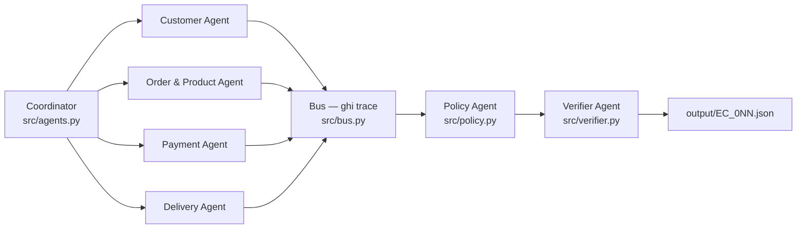

> **240 phút · Day 9 · advanced.** Bạn xây một hệ multi-agent điều tra 50 khiếu nại thương mại điện tử trên dữ liệu Olist thật: mỗi agent giữ một domain dữ liệu, [handoff](#glossary "Chuyển việc kèm bằng chứng từ agent này sang agent khác, mỗi lần chuyển ghi lại một dòng trace.") bằng chứng cho Coordinator, và một Verifier chặn output sai trước khi đóng gói nộp bài. Bốn step đầu chạy hoàn toàn offline, chưa cần API key.

Câu hỏi trọng tâm xuyên suốt Lab:

> **Với model ≤10B, phần nào của một case phải do code tính và phần nào để agent quyết? Ranh giới đó nằm ở đâu?**

| Mốc | Step | Xong sẽ có gì |
|---:|:---|:---|
| 0–30 | 1. Dựng data layer chạy offline | `python -m src.datastore <order_id>` in ra số thật của một order |
| 30–75 | 2. Viết 4 tool tính toán xác định | `python tests/test_tools.py` in ra `OK 11/11` |
| 75–115 | 3. Cài policy engine EC_POLICY_V2 | `python tests/test_policy.py` in ra `OK 8/8` |
| 115–160 | 4. Lắp 7 agent và ghi trace handoff | `logging/trace.jsonl` có ít nhất 7 dòng cho một case |
| 160–195 | 5. Verifier chặn output sai | `python scripts/validate_output.py` in ra `0 lỗi` |
| 195–240 | 6. Chạy 50 case, dựng artifact, nộp | `output/` đủ 50 JSON, zip đúng cấu trúc, 4 artifact repo có nội dung |

> **Mâu thuẫn trong repo — cách guide này xử lý**
>
> - `README.md` §8 ghi mốc 13h–18h (300 phút), nhưng cửa sổ làm bài là 13h30–17h30. Guide dùng **240 phút**.
> - 50 file `EC_001.json`–`EC_050.json` phát ở Checkpoint 1 và nay đã có trong `input/`. Step 1–5 vẫn chạy trên fixture `tests/fixtures/EC_SAMPLE.json` để không phụ thuộc thứ tự phát đề.
> - Repo **không có** `.gitignore` trong khi §9.4 cấm commit `.env`. Step 1 tạo `.gitignore` trước khi có `.env`.
> - `architecture.md`, `logging/metadata.json`, `logging/trace.jsonl` khởi đầu là file 0 byte. §8 yêu cầu cả ba có nội dung → step 4 và step 6.
> - §8 không nói thư mục cho `trace.jsonl` và `metadata.json`; repo đã đặt sẵn trong `logging/` → guide giữ nguyên chỗ đó.
> - Repo không có bộ test tự động nào. Step 2, 3, 5 dùng test do chính bạn viết cộng validation read-only, không phải bộ test có sẵn.

---

## 1. Dựng data layer chạy offline

**30 phút · mốc 0–30.**

:::goal{title="9 file CSV thành 7 index tra được trong bộ nhớ, chạy không cần mạng"}
Một hàm nhận `order_id` và trả về đủ dữ liệu của case đó: order, item, payment, seller, customer, product. Mọi agent về sau đọc từ đây, không agent nào tự mở CSV.
:::

### Tại sao không để mỗi agent tự đọc CSV?

Một case cần 6 phép nối bảng. `olist_order_items_dataset.csv` có 112650 dòng, `olist_orders_dataset.csv` có 99441 dòng. Nếu 7 agent × 50 case cùng quét tuyến tính thì bạn mất phần lớn 240 phút vào việc đọc đĩa.

Cách chữa là một [index](#glossary "Dict tra cứu dựng sẵn một lần, khoá là ID, giá trị là dòng hoặc danh sách dòng tương ứng.") dựng một lần lúc khởi động, rồi mọi tra cứu sau đó là `O(1)`.

**Quy ước cho cả bài:** mọi lệnh chạy từ **thư mục gốc repo**, sau khi đã kích hoạt `.venv`.

**Bạn làm:**

- Tạo `.venv` và kích hoạt (bắt buộc trước, vì nó làm lệnh `python` giống nhau trên cả ba OS).
- Tạo `.gitignore` (**FILE MỚI**) chặn `.venv`, `.env`, `__pycache__` — làm trước khi có `.env`, không phải sau.
- Tạo `src/__init__.py` (**FILE MỚI**) để rỗng, và `src/datastore.py` (**FILE MỚI**).
- Trong `src/datastore.py`, dựng 7 index và hàm `get_case_bundle(order_id)` trả về [case bundle](#glossary "Một dict gom toàn bộ dữ liệu thô của một order để các agent dùng chung, chưa qua tính toán.").

:::os
```bash tab="macOS / Linux"
python3 -m venv .venv && source .venv/bin/activate
mkdir -p src tests/fixtures scripts
printf '.venv/\n.env\n__pycache__/\n*.pyc\n.DS_Store\noutput.zip\n' > .gitignore
touch src/__init__.py src/datastore.py
```
```powershell tab="Windows"
python -m venv .venv; .venv\Scripts\Activate.ps1
New-Item -ItemType Directory -Path src, tests\fixtures, scripts -Force
".venv/`n.env`n__pycache__/`n*.pyc`n.DS_Store`noutput.zip" | Set-Content .gitignore
New-Item -ItemType File -Path src\__init__.py, src\datastore.py -Force
```
:::

Terminal hiện dấu `(.venv)` ở đầu dòng lệnh. Nó phải còn ở đó suốt buổi; mất là bạn đang chạy sai Python:

```text
(.venv) $
```

Kiểm lại bằng hai lệnh read-only:

```bash
ls data/*.csv | wc -l && grep -c . .gitignore
```

Kết quả đúng — 9 file CSV, và `.gitignore` có 6 dòng:

```text
       9
6
```

Đây là contract của `src/datastore.py`. Giữ nguyên tên hàm và tên khoá, vì step 2 đến step 5 gọi đúng những tên này:

```python
INDEXES = {
    "orders":    "order_id  -> dict (1 dòng)",
    "items":     "order_id  -> list[dict], GIỮ NGUYÊN thứ tự trong CSV",
    "payments":  "order_id  -> list[dict], GIỮ NGUYÊN thứ tự trong CSV",
    "customers": "customer_id -> dict",
    "products":  "product_id  -> dict",
    "sellers":   "seller_id   -> dict",
    "orders_by_unique_customer": "customer_unique_id -> list[order_id] theo thứ tự CSV",
}

def get_case_bundle(order_id: str) -> dict:
    """Trả về: {order_id, order, items, payments, customer, products, sellers, customer_orders}.
    - order: dict hoặc None nếu order_id không có trong CSV
    - items, payments: list, CÓ THỂ RỖNG (775 order không có item row)
    - sellers: list seller_id duy nhất, theo thứ tự xuất hiện trong items
    - products: list dict sản phẩm theo thứ tự item, phần tử có thể là None
    - customer_orders: mọi order_id của cùng customer_unique_id, kể cả order hiện tại
    Không tính toán gì ở đây. Không làm tròn. Không parse datetime.
    """
```

Thêm một khối `if __name__ == "__main__":` nhận `order_id` từ `sys.argv[1]` và in ra 8 dòng dưới. Chạy [smoke run](#glossary "Chạy cho thấy có output, không có assertion. Khác với test: smoke run không tự phán đúng sai.") trên case demo:

```bash
python -m src.datastore 0e3ec3c17b64c6cc7bc01bba21e7afdf
```

Kết quả đúng — các số phải khớp, cách trình bày tuỳ bạn:

```text
order_id        0e3ec3c17b64c6cc7bc01bba21e7afdf
status          delivered
items           2
sellers         1
payments        2
delivered_at    2017-06-08 05:47:38
estimated_at    2017-05-26 00:00:00
carrier_at      2017-05-17 10:03:46
```

**Nếu bị chậm:** dựng xong index `orders` và `items` là đủ điều kiện sang step 2; năm index còn lại thêm sau.
**Xong sớm:** thêm tham số `--stats` in ra số order theo từng `order_status`; `delivered` phải ra 96478.

:::checkpoint{title="Hoàn thành khi"}
[ ] `python -m src.datastore 0e3ec3c17b64c6cc7bc01bba21e7afdf` in ra `items 2` và `delivered_at 2017-06-08 05:47:38`
[ ] `grep -c . .gitignore` trả về số lớn hơn 0, và trong đó có dòng `.env`
[ ] Terminal hiện `(.venv)` ở đầu dòng lệnh
[ ] Bạn giải thích được vì sao `items` và `payments` phải là list có thể rỗng, thay vì dict một dòng
:::

:::caution{title="Vấn đề thường gặp"}
`KeyError: 'product_category_name'` khi đọc `data/product_category_name_translation.csv`
→ **Mindset**: file CSV không phải lúc nào cũng bắt đầu bằng ký tự đầu tiên bạn nhìn thấy.
→ File này có BOM, nên tên cột thật là `product_category_name`. Mở bằng `encoding="utf-8-sig"`. File này chỉ dùng để dịch tên category sang tiếng Anh — output chấm theo `product_category_name` gốc trong `olist_products_dataset.csv`, nên bạn có thể bỏ hẳn file translation. Bản trong repo vẫn nạp nó thành khoá cache thứ 8 `category_en` bên cạnh 7 index, nhưng chỉ dùng khi bật biến thể `V_CATEGORY_ENGLISH=1`; mặc định tắt nên `category_names` giữ nguyên tên Bồ Đào Nha.

Máy chạy chậm hẳn hoặc hết RAM lúc load
→ **Mindset**: nạp thứ không dùng là chi phí thuần.
→ `olist_geolocation_dataset.csv` có 1000163 dòng và **không xuất hiện trong output schema**. Đừng load nó. `olist_order_reviews_dataset.csv` cũng không có trong schema.
:::

---

## 2. Viết 4 tool tính toán xác định

**45 phút · mốc 30–75.**

:::goal{title="4 hàm trả đúng số của case demo, test tự chạy in ra OK 11/11"}
Toàn bộ số trong output cuối cùng — giờ trễ, tổng tiền, chênh lệch — do 4 hàm Python thuần sinh ra, không hàm nào gọi model.
:::

### Tại sao không để model tính?

Thử bảo một model 4.7B tính `2017-06-08 05:47:38` trừ `2017-05-26 00:00:00` ra bao nhiêu giờ. Nó sẽ trả một con số trông hợp lý. Đáp án đúng là 317.79.

Rubric ở `README.md` §8 chấm Delivery analysis 15% và Payment reconciliation 15% theo **giá trị số**. Đó là 30% điểm nằm hoàn toàn trong tay code [xác định](#glossary "Deterministic — cùng input thì luôn cùng output, không phụ thuộc model, nhiệt độ hay lần chạy.") — đừng đưa nó cho model.

**Bạn làm:**

- Tạo `src/tools.py` (**FILE MỚI**) với đúng 4 hàm dưới, giữ nguyên tên và thứ tự tham số.
- Tạo `tests/fixtures/EC_SAMPLE.json` (**FILE MỚI**) theo đúng schema input ở `README.md` §3, với `claimed_order_id` là case demo.
- Tạo `tests/test_tools.py` (**FILE MỚI**) với 8 assert dùng số ở bảng bên dưới.

```python
def analyze_delivery(bundle: dict) -> dict:
    """-> delivered_at, estimated_delivery_at, carrier_handoff_at,
          delivery_variance_hours, seller_handoff_analysis[], late_handoff_seller_ids[]

    delivery_variance_hours = delivered_customer - estimated_delivery, đơn vị giờ
    handoff_variance_hours  = delivered_carrier - shipping_limit SỚM NHẤT của seller đó
    late_handoff = handoff_variance_hours > 0
    Thiếu timestamp -> None, không phải 0. Làm tròn 2 số ở bước cuối.
    """

def reconcile_payment(bundle: dict) -> dict:
    """-> item_total_brl, freight_total_brl, expected_total_brl,
          payment_total_brl, difference_brl, reconciled, payment_types[]
    Không có item row -> expected_total_brl, difference_brl, reconciled đều None.
    """

def build_customer_context(bundle: dict) -> dict:
    """-> customer_unique_id, related_order_ids[]  (order khác của cùng customer_unique_id)"""

def build_product_context(bundle: dict) -> dict:
    """-> product_ids[], category_names[]  (duy nhất, theo thứ tự xuất hiện trong items)"""
```

Tám assert bắt buộc, lấy từ case demo `0e3ec3c17b64c6cc7bc01bba21e7afdf`. Các số này đã đối chiếu trực tiếp với CSV:

| # | Trường | Giá trị đúng |
|---:|:---|---:|
| 1 | `delivery_variance_hours` | 317.79 |
| 2 | `seller_handoff_analysis[0].handoff_variance_hours` | 17.56 |
| 3 | `late_handoff_seller_ids` | 1 phần tử |
| 4 | `item_total_brl` | 119.80 |
| 5 | `freight_total_brl` | 25.52 |
| 6 | `payment_total_brl` | 145.32 |
| 7 | `difference_brl` | 0.00 |
| 8 | `reconciled` | `True` |

Viết `tests/test_tools.py` sao cho chạy được bằng `python` trần, không cần cài thêm gói: các hàm đặt tên `test_*`, cuối file gọi hết và in `OK <pass>/<total>`.

```bash
python tests/test_tools.py
```

Kết quả đúng — 8 assert bắt buộc. Bản trong repo có thêm 3 assert của phần "Xong sớm" nên in `OK 11/11`:

```text
OK 11/11
```

**Nếu bị chậm:** làm xong `analyze_delivery` và `reconcile_payment` là đủ điều kiện sang step 3 — hai hàm này chiếm 30% rubric, hai hàm context chiếm 15%.
**Xong sớm:** thêm assert cho một order không có item row (ví dụ `8e24261a7e58791d10cb1bf9da94df5c`, status `unavailable`) và khẳng định cả ba trường tiền trả `None`.

:::quiz{id="q-payment-value" answer="b"}
Một order có `payment_installments = 8` và `payment_value = 99.33`. Tổng payment của order này là bao nhiêu, nếu order chỉ có một payment row?

- a) 794.64 — vì trả 8 kỳ
- b) 99.33 — vì `payment_value` là số tiền của cả payment row
- c) 12.42 — vì chia đều 8 kỳ
:::

:::checkpoint{title="Hoàn thành khi"}
[ ] `python tests/test_tools.py` in ra `OK 11/11`
[ ] `tests/fixtures/EC_SAMPLE.json` parse được: `python -m json.tool tests/fixtures/EC_SAMPLE.json` không báo lỗi
[ ] Không hàm nào trong `src/tools.py` gọi model hay gọi mạng
[ ] Bạn giải thích được vì sao `handoff_variance_hours` lấy `shipping_limit_date` sớm nhất của seller chứ không phải của item
:::

:::caution{title="Vấn đề thường gặp"}
`difference_brl` lệch vài đồng ở nhiều case
→ **Mindset**: làm tròn là phép mất thông tin — làm càng sớm thì sai số càng chồng.
→ Cộng full precision rồi mới `round(x, 2)` ở bước cuối. Đừng round từng item.

Thứ tự `payment_ids` trong output khác thứ tự trong CSV
→ **Mindset**: "sắp xếp cho đẹp" là một thay đổi dữ liệu, không phải trình bày.
→ `README.md` §6 yêu cầu giữ thứ tự nguồn. Case demo có `payment_sequential` là 2 rồi mới tới 1 trong CSV — giữ nguyên đúng như vậy, đừng `sort()`.

`TypeError: '>' not supported between instances of 'NoneType' and 'datetime'`
→ **Mindset**: order chưa giao thì không có ngày giao, đó là dữ liệu đúng chứ không phải lỗi.
→ 2963 order không ở trạng thái `delivered`. Kiểm `None` trước mọi phép so sánh thời gian.
:::

---

## 3. Cài policy engine EC_POLICY_V2

**40 phút · mốc 75–115.**

:::goal{title="Một bundle vào, ra đúng primary issue, refund và danh sách action theo thứ tự"}
`classify(bundle, analysis)` trả về đúng một `primary_issue`, danh sách `secondary_issues` đúng thứ tự, số tiền hoàn và chuỗi action — tất cả bằng luật, không bằng model.
:::

### Tại sao thứ tự kiểm quan trọng hơn bản thân luật?

Một order vừa `canceled` vừa giao trễ thoả **hai** dòng trong bảng `EC_POLICY_V2`. Chỉ có một đáp án đúng, và nó được quyết bởi dòng nào kiểm trước.

[Policy engine](#glossary "Chuỗi điều kiện kiểm theo thứ tự cố định, dừng ở nhánh khớp đầu tiên. Không phải bộ luật cho model đọc.") ở đây là một chuỗi `if / elif` — dừng ở nhánh khớp đầu tiên, không đi tiếp.

**Bạn làm:**

- Đọc lại bảng `EC_POLICY_V2` ở `README.md` §4 — guide này không chép lại luật, chỉ bổ sung thứ tự kiểm và bẫy.
- Tạo `src/policy.py` (**FILE MỚI**) với `classify(bundle, analysis) -> dict`, trong đó `analysis` là dict gộp kết quả của 4 hàm ở step 2.
- Tạo `tests/test_policy.py` (**FILE MỚI**): mỗi primary issue một case, 6 case.

| Thứ tự kiểm | Primary issue | Dừng lại khi | Refund | Bẫy hay gặp |
|---:|:---|:---|:---|:---|
| 1 | `canceled_order_paid` | `status = canceled` và tổng payment > 0 | tổng payment | 3 order `canceled` có tổng payment bằng 0 → không rơi vào nhánh này |
| 2 | `unavailable_order_paid` | `status = unavailable` và tổng payment > 0 | tổng payment | 603 trong số này không có item row → tiền phải là `None` |
| 3 | `late_delivery_seller` | giao trễ **và** có ít nhất 1 seller bàn giao muộn | tổng freight | responsible là **các seller vi phạm**, không phải toàn bộ seller |
| 4 | `late_delivery_logistics` | giao trễ và không seller nào muộn | tổng freight | party_id là `LOGISTICS_PROVIDER`, không phải seller_id |
| 5 | `valid_split_payment` | từ 2 payment row và `reconciled` | 0 | **không** thêm `verify_payment_allocation` ở nhánh này |
| 6 | `unsupported_late_claim` | giao đúng hạn và payment khớp | 0 | `case_status` là `no_action`, không phải `action_required` |

Ba thứ còn lại phải sinh cùng lúc với primary issue, vì chúng phụ thuộc vào nó:

- `secondary_issues` — kiểm theo đúng 5 thứ tự ở `README.md` §4, thêm cái nào thoả, không sắp lại.
- `evidence_ids` — dựng theo 5 dạng ở §5. Sai dạng bị tính false positive, mất điểm 15% Root cause và evidence.
- `resolution_actions` — action chính trước, rồi các action bổ sung theo thứ tự §4.

Case demo phải ra đúng kết quả này. Dùng nó làm case đầu tiên trong `tests/test_policy.py`:

```json
{
  "primary_issue": "late_delivery_seller",
  "secondary_issues": ["multi_item_order", "split_payment"],
  "case_status": "action_required",
  "recommended_refund_brl": 25.52,
  "ranked_causes": [{"cause_code": "SELLER_HANDOFF_AFTER_LIMIT", "rank": 1}],
  "responsible_parties": [{"party_type": "seller", "party_id": "cca3071e3e9bb7d12640c9fbe2301306"}],
  "resolution_actions": ["refund_freight", "review_seller_handoff", "verify_payment_allocation"]
}
```

Chú ý case demo **không** có `multi_seller_order` (chỉ 1 seller), **không** có `repeat_customer` (customer này không có order nào khác), **không** có `multiple_categories` (2 item cùng một product, category `moveis_decoracao`).

```bash
python tests/test_policy.py
```

Kết quả đúng — 6 nhánh bắt buộc. Bản trong repo có thêm 2 case bẫy nên in `OK 8/8`:

```text
OK 8/8
```

**Nếu bị chậm:** làm xong nhánh 1–4 là đủ điều kiện sang step 4; nhánh 5 và 6 chỉ khác ở chỗ refund bằng 0.
**Xong sớm:** viết một case bẫy — order `canceled` **và** giao trễ — rồi khẳng định kết quả là `canceled_order_paid`, không phải `late_delivery_seller`.

:::checkpoint{title="Hoàn thành khi"}
[ ] `python tests/test_policy.py` in ra `OK 8/8`
[ ] Case demo ra đúng `recommended_refund_brl` bằng 25.52, không phải 145.32
[ ] Mọi `evidence_ids` sinh ra khớp một trong 5 dạng ở `README.md` §5
[ ] Bạn giải thích được vì sao một order vừa `canceled` vừa giao trễ chỉ được nhận một `primary_issue`
:::

:::caution{title="Vấn đề thường gặp"}
Refund ra bằng tổng đơn hàng ở case giao trễ
→ **Mindset**: khoản hoàn phải khớp với thiệt hại mà bên chịu trách nhiệm gây ra.
→ Giao trễ hoàn **freight**, không hoàn tiền hàng. Hoàn toàn bộ chỉ ở `canceled` và `unavailable`.

Case `unavailable` bị crash hoặc ra `expected_total_brl` bằng 0
→ **Mindset**: 0 nghĩa là "đã tính, ra không đồng"; `None` nghĩa là "không có cơ sở để tính". Hai thứ khác nhau.
→ 775 order không có item row. `README.md` §4 yêu cầu ba trường tiền là `null` và các mảng là rỗng.

`case_status` và refund mâu thuẫn nhau
→ **Mindset**: hai trường này là một quyết định viết ở hai chỗ.
→ `action_required` thì refund phải lớn hơn 0. `no_action` thì refund phải bằng 0. Thêm một assert cho đúng ràng buộc này.
:::

---

## 4. Lắp 7 agent và ghi trace handoff

**45 phút · mốc 115–160.**

:::goal{title="Coordinator giao việc cho 6 agent, mỗi lần giao và trả đều để lại một dòng trace"}
Một case chạy qua 7 agent, `logging/trace.jsonl` ghi lại ai giao gì cho ai và nhận về bằng chứng nào.
:::

### Tại sao đặt tên 7 agent chưa phải là multi-agent?

`README.md` §7 nói thẳng: không có điểm cho việc đặt tên nhiều agent nhưng toàn bộ xử lý nằm trong một prompt. Thứ phân biệt hai kiểu là **bằng chứng**: mỗi agent chỉ nhìn thấy phần dữ liệu của mình, và mỗi lần chuyển việc để lại một dòng log kiểm được.

Mỗi lần chuyển việc là một [envelope](#glossary "Một dict cố định gồm from, to, task, payload — đơn vị nhỏ nhất của một lần chuyển việc giữa hai agent.") đi qua `src/bus.py`, và bus ghi trace. Không agent nào gọi thẳng agent khác.



**Bạn làm:**

- Tạo `.env.example` (**FILE MỚI**) chỉ chứa tên biến, không chứa giá trị. File `.env` thật là **KHÔNG COMMIT** — `.gitignore` ở step 1 đã chặn.
- Tạo `src/llm.py` (**FILE MỚI**): một hàm `chat(system, user) -> str`. Tên model đặt **trong code**, không đặt trong `.env` — `README.md` §9.4 yêu cầu vậy để chấm được.
- Tạo `src/bus.py` (**FILE MỚI**): `send(envelope) -> dict`, ghi một dòng JSON vào `logging/trace.jsonl` mỗi lần gọi.
- Tạo `src/agents.py` (**FILE MỚI**): 7 agent, mỗi agent một hàm, mỗi agent nhận đúng phần bundle của mình.
- Tạo `src/run_case.py` (**FILE MỚI**): đọc 1 file input, chạy hết chuỗi, in ra JSON kết quả.

Bảng này là ranh giới quyền truy cập. Nó cũng là thứ bạn sẽ vẽ lại trong `architecture.md` ở step 6:

| Agent | Đọc được gì | Trả về gì | Có gọi model không |
|:---|:---|:---|:---:|
| Coordinator | input JSON | phân rã task, gom kết quả | có |
| Customer | `customers`, `orders` | `customer_context` | không |
| Order & Product | `items`, `products`, `sellers` | `affected_entities`, `product_context` | không |
| Payment | `payments`, `items` | `payment_reconciliation` | không |
| Delivery | `orders`, `items` | `delivery_analysis` | không |
| Policy | kết quả 4 agent trên, cộng 5 trường tối thiểu cắt ra từ bundle | `case_assessment`, `root_cause_analysis`, `financial_resolution` | không |
| Verifier | JSON dựng xong | danh sách lỗi hoặc rỗng | có |

Chỉ 2 trong 7 agent gọi model. Bốn agent dữ liệu gọi tool ở `src/tools.py`, Policy Agent gọi `src/policy.py`. Đây chính là câu trả lời cho câu hỏi trọng tâm của Lab — và bạn phải bảo vệ được lựa chọn này ở step 6.

Mỗi dòng trace giữ đúng các khoá sau, một dòng một JSON, không xuống dòng giữa chừng:

```json
{"ts": "2026-08-05T13:58:02", "case_id": "EC_SAMPLE", "from": "coordinator", "to": "delivery_agent", "task": "analyze_delivery", "payload_keys": ["order_id"], "status": "ok", "result_keys": ["delivered_at", "delivery_variance_hours"], "latency_ms": 12}
```

```bash
python -m src.run_case tests/fixtures/EC_SAMPLE.json && wc -l < logging/trace.jsonl
```

Kết quả đúng — 6 lần chuyển việc cộng 2 dòng ghi chú của Coordinator và Verifier:

```text
8
```

:::input{id="ranh-gioi-code-va-agent" target="architecture.md#ranh-giới-code-và-agent" lines="4"}
Trong hệ của nhóm bạn, agent nào được phép quyết định, và quyết định nào bắt buộc phải do code tính? Nêu một trường hợp cụ thể mà nhóm bạn đã chuyển việc từ model sang code, và lý do.
:::

**Nếu bị chậm:** chạy được Coordinator cộng 4 agent dữ liệu (bỏ tạm phần model của Verifier) là đủ điều kiện sang step 5.
**Xong sớm:** thêm `latency_ms` và `retry_count` vào trace, rồi đo agent nào chậm nhất trên 5 case.

:::checkpoint{title="Hoàn thành khi"}
[ ] `python -m src.run_case tests/fixtures/EC_SAMPLE.json` in ra JSON có đủ 11 khoá cấp một của schema §6
[ ] `wc -l < logging/trace.jsonl` trả về ít nhất 7
[ ] `git status` **không** thấy `.env` trong danh sách file sẽ commit
[ ] Bạn giải thích được vì sao Payment Agent không được đọc `orders`, và điều đó ngăn được lỗi gì
:::

:::caution{title="Vấn đề thường gặp"}
`json.decoder.JSONDecodeError: Expecting value: line 1 column 1`
→ **Mindset**: model ≤10B thường trả JSON kèm một câu mở đầu lịch sự. Đó là hành vi bình thường, không phải model hỏng.
→ Cắt phần trước dấu `{` đầu tiên và sau dấu `}` cuối cùng trước khi `json.loads`. Thêm 1 lần retry với lời nhắc ngắn hơn.

Agent trả kết quả khác nhau giữa hai lần chạy cùng một case
→ **Mindset**: cùng input phải ra cùng output, nếu không thì không debug được.
→ Đặt `temperature` bằng 0. Nếu vẫn lệch, phần đang lệch là phần lẽ ra thuộc về code chứ không thuộc về model.

Chạy 1 case mất hơn 60 giây
→ **Mindset**: 50 case × 60 giây là 50 phút, bạn không còn ngần ấy thời gian.
→ Đếm số lần gọi model trong một case. Bảng quyền truy cập ở trên chỉ cho phép 2.
:::

---

## 5. Verifier chặn output sai trước khi đóng gói

**35 phút · mốc 160–195.**

:::goal{title="Không bộ output nào được đóng gói khi còn sai schema, sai giới hạn hoặc sai dạng evidence"}
`verify(result)` trả về danh sách lỗi. `run_all.py` vẫn ghi file nhưng in tên case lỗi và trả exit code khác 0; chỗ chặn thật là `scripts/make_zip.py` — còn lỗi thì không đóng gói được, sửa rồi chạy lại.
:::

### Tại sao một lỗi nhỏ lại mất cả case?

`README.md` §8 ghi: case bị [hard gate](#glossary "Điều kiện chặn — vi phạm là toàn bộ case nhận 0 điểm, không chấm từng phần.") nhận 0 điểm. Một `evidence_id` sai dạng hoặc một mảng vượt giới hạn có thể xoá sạch 6 phần điểm bạn đã làm đúng.

Verifier rẻ hơn debug: 20 phút viết luật kiểm đổi lấy việc không mất case nào vì lỗi định dạng.

**Bạn làm:**

- Tạo `src/verifier.py` (**FILE MỚI**) với `verify(result) -> list[str]`, rỗng nghĩa là đạt.
- Tạo `scripts/validate_output.py` (**FILE MỚI**): quét mọi file trong `output/`, chạy `verify`, in tổng số lỗi. Đây là lệnh validation read-only, không sửa file.

Mười hai luật bắt buộc, rút từ `README.md` §5 và §6:

| # | Luật | Nguồn |
|---:|:---|:---|
| 1 | Có đủ 11 khoá cấp một, không thừa khoá lạ | §6 |
| 2 | `case_id` khớp tên file input | §6 |
| 3 | `confidence` nằm trong đoạn 0 đến 1 | §6 |
| 4 | `case_status` là `action_required` hoặc `no_action` | §6 |
| 5 | Giới hạn mảng: 5 order, 5 item, 3 seller, 5 payment, 5 related order | §6 |
| 6 | Giới hạn mảng: 5 product, 5 category, 3 cause, 3 party, 20 evidence, 5 action | §6 |
| 7 | Mọi `evidence_id` khớp 1 trong 5 dạng | §5 |
| 8 | Mọi ID trong evidence tồn tại thật trong CSV | §5 |
| 9 | Timestamp đúng dạng `YYYY-MM-DD HH:MM:SS` hoặc `null` | §6 |
| 10 | Order không có item row thì 3 trường tiền là `null`, các mảng rỗng | §4 |
| 11 | `action_required` thì refund lớn hơn 0; `no_action` thì refund bằng 0 | §6 |
| 12 | Order lịch sử **không** nằm trong `affected_entities` | §3 |

Luật 12 là luật dễ mất điểm nhất và khó tự thấy nhất: order cũ của khách chỉ được xuất hiện trong `customer_context.related_order_ids`.

```bash
python -m src.run_case tests/fixtures/EC_SAMPLE.json > output/EC_SAMPLE.json && python scripts/validate_output.py
```

Kết quả đúng:

```text
1 file, 0 lỗi
```

Xoá file thử trước khi sang step 6, vì zip nộp bài chỉ được chứa 50 file `EC_001.json` đến `EC_050.json`:

```bash
rm output/EC_SAMPLE.json && ls output/ | wc -l
```

Kết quả đúng — chỉ còn `.gitkeep`:

```text
       1
```

**Nếu bị chậm:** làm luật 1, 5, 6, 7 trước — bốn luật này chặn phần lớn lỗi hard gate.
**Xong sớm:** thêm chế độ `--fix` tự cắt mảng vượt giới hạn thay vì chỉ báo lỗi.

:::checkpoint{title="Hoàn thành khi"}
[ ] `python scripts/validate_output.py` in ra `0 lỗi`
[ ] Bạn thử sửa tay một `evidence_id` thành `item:1` và verifier bắt được lỗi đó
[ ] `ls output/` chỉ còn `.gitkeep`
[ ] Bạn giải thích được vì sao chỗ chặn thật nằm ở `scripts/make_zip.py` chứ không phải ở bước ghi file
:::

:::caution{title="Vấn đề thường gặp"}
Verifier báo `0 lỗi` trên mọi file kể cả file bạn cố tình làm sai
→ **Mindset**: một validator chưa từng fail là một validator chưa được kiểm.
→ Sửa tay một file cho sai rồi chạy lại. Không bắt được thì luật đó đang `return` sớm hoặc `try/except` nuốt lỗi.

`null` bị ghi thành chuỗi `"null"` hoặc thành `"None"`
→ **Mindset**: JSON `null` và chuỗi `"null"` là hai giá trị khác nhau với bộ chấm.
→ Dùng `None` trong Python, `json.dump` sẽ ghi ra `null`. Đừng tự nối chuỗi JSON.

Timestamp ra dạng `2018-03-31T15:23:33`
→ **Mindset**: định dạng nguồn là một phần của contract.
→ §6 yêu cầu giữ nguyên dạng trong CSV, có dấu cách, không có chữ `T`. Đừng gọi `datetime.isoformat()`.
:::

---

## 6. Chạy 50 case, dựng artifact repo và nộp

**45 phút · mốc 195–240.**

:::goal{title="output/ đủ 50 JSON hợp lệ, 4 artifact repo có nội dung, zip đúng cấu trúc"}
Chạy hết 50 input thật, dựng `architecture.md`, `logging/metadata.json`, báo cáo cá nhân, rồi nén và nộp.
:::

**Bạn làm:**

- Tạo `src/run_all.py` (**FILE MỚI**): duyệt `input/*.json`, ghi `output/<tên file input>`, in tiến độ và tổng lỗi.
- Điền `architecture.md` (đang 0 byte): sơ đồ agent, bảng quyền truy cập dữ liệu, luồng handoff.
- Điền `logging/metadata.json` (đang 0 byte): model, parameter size, framework, runtime.
- Mỗi người copy một file báo cáo có sẵn ở gốc repo (ví dụ `individual_01642_NguyenQuyDuong.md`) thành `individual_` cộng 5 số cuối MSSV cộng họ tên viết liền của mình, rồi điền hết các ô trong ngoặc vuông.
- Tạo `scripts/make_zip.py` (**FILE MỚI**): kiểm 50 file rồi nén, entry giữ dạng `output/EC_0NN.json`.

```bash
python src/run_all.py && ls output/*.json | wc -l && python scripts/validate_output.py
```

Kết quả đúng — thời gian phụ thuộc tốc độ model của bạn:

```text
[50/50] EC_050.json -> unsupported_late_claim

50 case xong trong 110.0s, 0 lỗi verifier
      50
50 file, 0 lỗi
```

`logging/metadata.json` khai đúng thứ bạn thật sự chạy. Giá trị dưới đây là cấu hình đã chạy hết 50 case trong repo này; sửa lại theo model nhóm bạn dùng:

```json
{
  "model": "qwen3.5:4b",
  "parameter_size": "4.7B",
  "quantization": "Q4_K_M",
  "framework": "ollama",
  "runtime": "ollama 0.32.5, Python 3.11.15, macOS arm64",
  "temperature": 0.0,
  "agents": 7,
  "llm_calls_per_case": 2,
  "model_declared_in": "src/llm.py"
}
```

Trần tham số ở `README.md` §9.1 là 10B. `4.7B` nằm dưới trần. Khai sai chỗ này là hard gate.

:::input{id="quyen-truy-cap-du-lieu" target="architecture.md#quyền-truy-cập-dữ-liệu" lines="5"}
Liệt kê 7 agent của nhóm bạn: mỗi agent đọc được bảng dữ liệu nào, trả về khoá nào trong output, và agent nào là bên nhận. Ghi rõ agent nào gọi model và agent nào không.
:::

:::export{targets="architecture.md"}
Tải nội dung hai ô điền ở trên về, ghép vào `architecture.md` ở gốc repo theo đúng tên section, rồi commit cùng sơ đồ agent.
:::

### Security check trước khi push

```bash
git status --short && grep -rniE "sk-[a-z0-9]{8}|api_key *= *[\"'][^\"']" --include="*.py" src/ scripts/
```

Kết quả đúng — danh sách file của bạn sẽ khác, điều kiện đạt là **không dòng nào chứa `.env`** và phần `grep` không in ra gì:

```text
 M architecture.md
 M logging/metadata.json
?? src/
```

### Nén và nộp

Form nộp bài đòi entry trong zip **giữ tiền tố thư mục**: `output/EC_001.json` đến `output/EC_050.json`. Nén từ bên trong `output/` ra file phẳng là bị từ chối. Trần dung lượng 5 MB, và zip không được lẫn file nào khác — kể cả `.gitkeep`.

Hai cách nén trên hai OS cho ra hai cấu trúc khác nhau, nên đóng gói bằng Python để cả lớp ra cùng một kết quả. `scripts/make_zip.py` chạy verifier trước rồi mới nén, nên một bộ output còn lỗi sẽ không đóng gói được:

```bash
python scripts/make_zip.py
```

Kết quả đúng — 50 entry, entry đầu và entry cuối phải có tiền tố `output/`:

```text
output.zip: 50 entry, 48964 bytes
entry đầu output/EC_001.json | entry cuối output/EC_050.json
```

Bảng điểm ở `README.md` §8 — mỗi ô trỏ về đúng một file bạn đã tạo:

| Thành phần | Trọng số | File quyết định điểm |
|:---|---:|:---|
| Primary và secondary issues | 15% | `src/policy.py` |
| Affected entities | 15% | `src/agents.py` (Order & Product Agent) |
| Customer và product context | 15% | `src/tools.py` |
| Delivery analysis | 15% | `src/tools.py` |
| Payment reconciliation | 15% | `src/tools.py` |
| Root cause và evidence | 15% | `src/policy.py` |
| Financial resolution và actions | 10% | `src/policy.py` |

**Nếu bị chậm:** chạy `run_all.py` trước, nộp zip trước, rồi mới hoàn thiện `architecture.md` — leaderboard chốt lúc 17h30.
**Xong sớm:** chạy lại 50 case lần hai và diff hai lần output. Có file nào khác nhau nghĩa là còn chỗ phụ thuộc model mà lẽ ra phải là code.

### Checklist artifacts bắt buộc

[ ] `output/` có đúng 50 file, từ `EC_001.json` đến `EC_050.json`
[ ] `output.zip` chứa đúng 50 entry `output/EC_001.json` đến `output/EC_050.json`, dưới 5 MB
[ ] [architecture.md](../architecture.md) có sơ đồ agent, quyền truy cập và luồng handoff
[ ] [logging/metadata.json](../logging/metadata.json) khai model, parameter size, framework, runtime
[ ] [logging/trace.jsonl](../logging/trace.jsonl) là trace của lượt chạy 50 case mới nhất
[ ] Mỗi người có một file báo cáo cá nhân ở gốc repo, không còn ô trống trong ngoặc vuông
[ ] `.env` không nằm trong repo, `.gitignore` có dòng `.env`
[ ] Toàn bộ source code đã push trước khi nộp zip

:::checkpoint{title="Hoàn thành khi"}
[ ] `ls output/*.json | wc -l` trả về 50
[ ] `python scripts/validate_output.py` in ra `0 lỗi`
[ ] `git status --short` không có dòng nào chứa `.env`
[ ] Bạn trả lời được câu hỏi trọng tâm: phần nào của case do code tính, phần nào để agent quyết, và vì sao ranh giới nằm ở đó
:::

:::caution{title="Vấn đề thường gặp"}
Form nộp báo `ZIP phải chứa đúng output/EC_001.json đến output/EC_050.json`
→ **Mindset**: cấu trúc bên trong zip là một phần của contract, không phải chuyện đóng gói cho gọn.
→ Entry phải giữ tiền tố `output/`. Kiểm bằng `unzip -Z1 output.zip | head -1`; ra `EC_001.json` là sai, ra `output/EC_001.json` là đúng.

Zip lẫn `.gitkeep` hoặc `.DS_Store`
→ **Mindset**: lệnh nén của macOS gom cả file ẩn mà terminal không hiện ra.
→ `scripts/make_zip.py` chỉ ghi đúng 50 tên trong danh sách, nên không lẫn được. Nén tay thì phải tự loại.

Thiếu vài file trong `output/` mà không ai để ý
→ **Mindset**: một vòng lặp nuốt exception sẽ bỏ qua case lỗi trong im lặng.
→ `run_all.py` phải đếm và in ra số case xong. Thiếu thì in tên case lỗi, đừng chỉ `pass`.

`logging/trace.jsonl` bị nối thêm trace của các lần chạy trước
→ **Mindset**: §8 yêu cầu trace của lượt chạy mới nhất, không phải lịch sử tích luỹ.
→ Mở file ở chế độ ghi đè khi `run_all.py` bắt đầu, rồi append trong lúc chạy.
:::

> Thứ tách một hệ multi-agent thật khỏi một prompt dài là bằng chứng: mỗi agent chỉ nhìn thấy phần dữ liệu của mình, và mỗi lần chuyển việc để lại một dòng kiểm được trong `logging/trace.jsonl`. Bảo vệ được ranh giới đó trong `architecture.md` là bảo vệ được điểm của cả nhóm.
